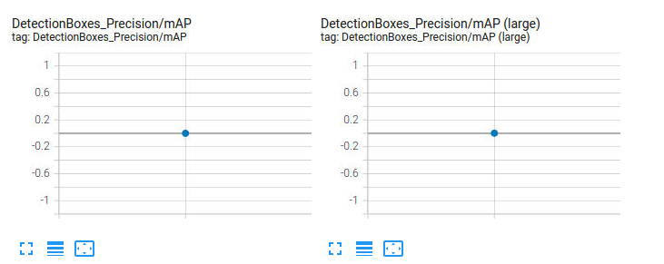
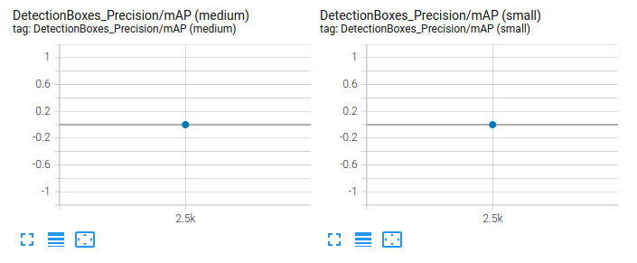
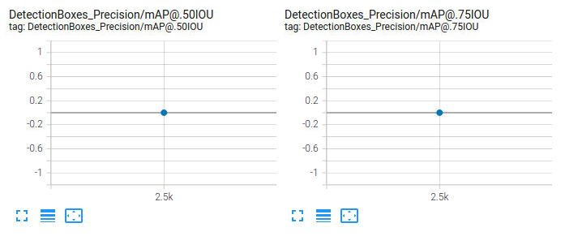
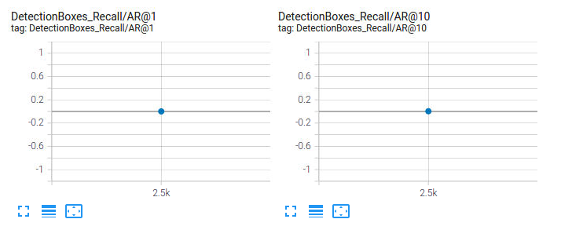
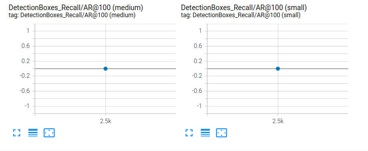
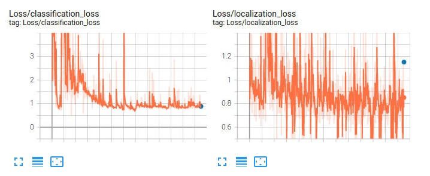
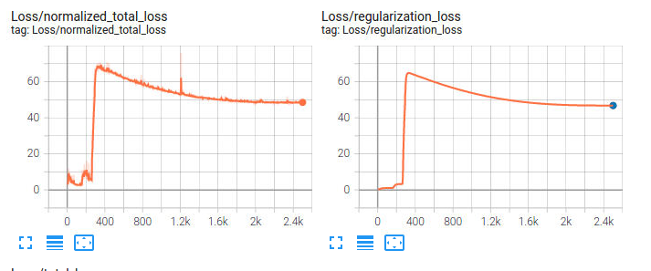
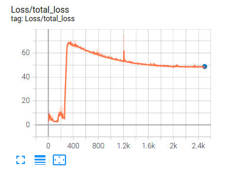

# Project Overview

This project has the goal of detecting objects in an urban environment, which is a very important tool when it comes to Self Driving Cars. The human hability of driving requires acknowledge the differente between pedestrians, other cars and traffic signals, for example. Detecting objects gives us the tool to take different responses to every single case, which is essential to driving safety. 

# Set up

To get the details on running the code, follow the instructions in the file [README.md](https://github.com/brucefie/sdc-p1-objectdetection/blob/main/README.md). 
While working on the project, it was not necessary to download the data or use a particular GPU, since the Udacity Workspace was used.

# Dataset

The data analysed was from Waymo, containing pictures with streets, pedestrians and cars, like in example above. 

After the Exploratory Data Analysis, there is the result that the data contained mostly cars, comparing to the other objects.

These images were initially on the paste "training_and_validation" and it was splitted to the validation and training paste, using 80% of the 100 images to training and 20% to validation, also 3 images went to test paste.  

# Training

The first try on training did not include any change in the data augmentations options, the [pipeline_new.config](experiments/reference/pipeline_new.config) was used. 
The results can be seen down below. The first parameters we can see are precision and recall, which are close to each other, as expected.

     

The next parameters we can see are the classification loss, regularization loss, total loss and training loss. These losses were low, which indicates the model is doing fine, but it could get better, as expected. To get the best results, we would have losses more close to 0, which means the prediction corresponds to the real image.

      

In order to test this model with different images, another experiment was made. The changes were applied on the [pipeline_new.config](https://github.com/brucefie/sdc-p1-objectdetection/blob/main/experiments/experiment2/pipeline_new.config), where random constrast and grey were applied to some images, as you can check the details in the pipeline_newconfig in the section train_config (line 146 to 156). 
First there is the recall and precision, which did not change a lot comparing to the first experiment.

     

In the losses it is more clear that some difference in the parameters. The classification and localization losses were close to the first experiment, but a better result was expected in the total loss and regularization loss, which were very different from the first experiment without the augmentations.

  

In order to improve this model and its results, it is necessary to get different types of data, containing more balanced numbers of cyclists, cars and pedestrians, so the model can train better and detect different objects in different urban environments and in different conditions.

