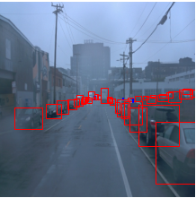
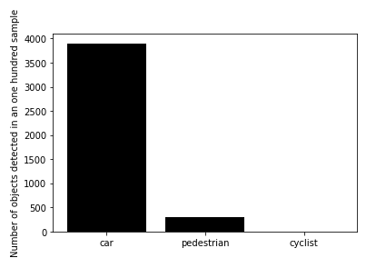

# Project Overview

This project has the goal of detecting objects in an urban environment, which is a very important tool when it comes to Self Driving Cars. The human hability of driving requires acknowledge the differente between pedestrians, other cars and traffic signals, for example. Detecting objects gives us the tool to take different responses to every single case, which is essential to driving safety. 

# Set up

To get the details on running the code, follow the instructions in the file [README.md](https://github.com/brucefie/sdc-p1-objectdetection/blob/main/README.md). 
While working on the project, it was not necessary to download the data or use a particular GPU, since the Udacity Workspace was used.

# Dataset

The data analysed was from Waymo, containing pictures with streets, pedestrians and cars, like in example above. 

After the Exploratory Data Analysis, there is the result that the data contained mostly cars, comparing to the other objects.

These images were initially on the paste "training_and_validation" and it was splitted to the validation and training paste, using 80% of the 100 images to training and 20% to validation, also 3 images went to test paste.  
